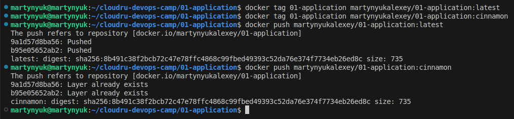

## 01-application

По заданию приложение должно возвращать страничку с (дословно):
- имя хоста
- ip адрес хоста
- имя автора, которое передаётся через переменную окружения $AUTHOR

Из контекста не понятно, понимается ли под хостом клиент или сервер с приложением. \
Поскольку делаем echo-server, написал возвращение ip клиента. \
Под именем хоста понимаю hostname на сервере, где запущенно данное приложение.

Сбилдить образ и запустить контейнер:
```
docker build -t 01-application .

docker run -e AUTHOR=MartynyukAlexey -p 8000:8000 01-application
```

Тегирование образа и пуш в registry:
```
docker tag 01-application martynyukalexey/01-application:latest
docker tag 01-application martynyukalexey/01-application:cinnamon

docker push martynyukalexey/01-application:latest
docker push martynyukalexey/01-application:cinnamon
```


