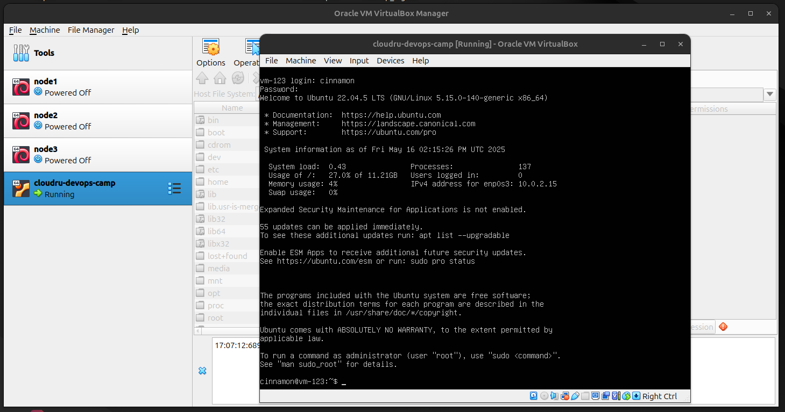
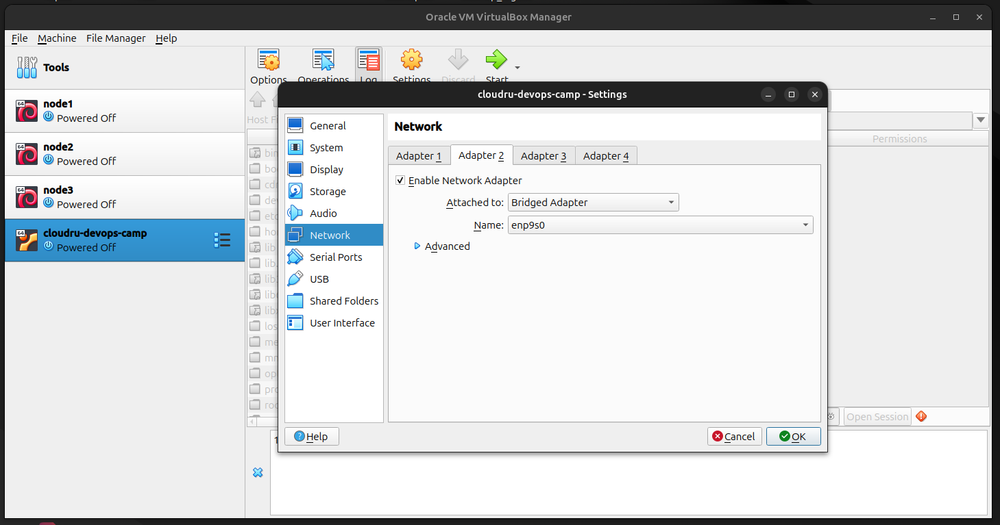
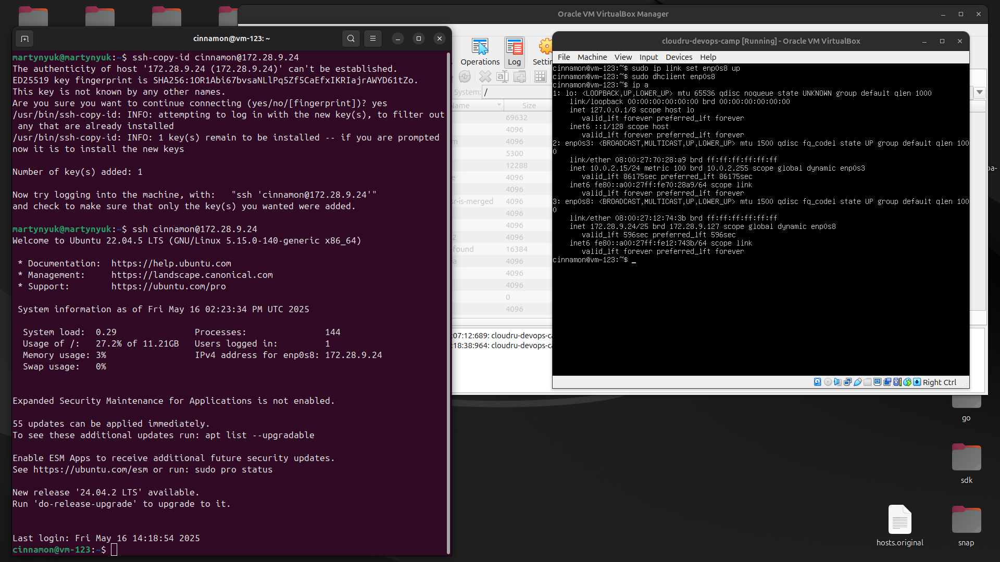
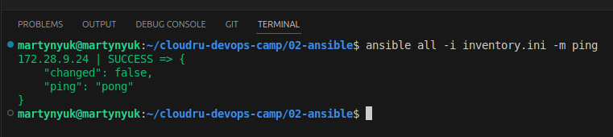
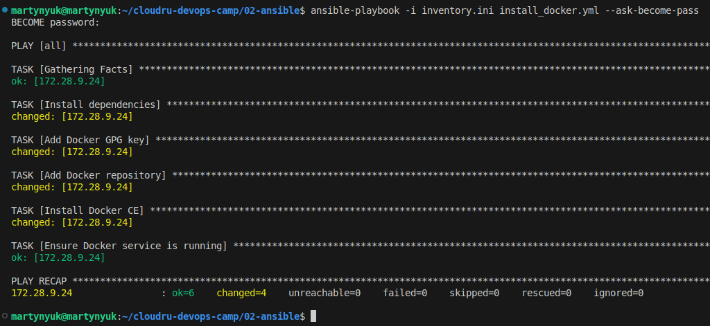

## Task 02-ansible

Для этого задания я использую Virtual Box.

Создаю виртуальную машину



Для доступа к ней с хоста добавляю bridged-adapter



Настраиваю сетевой интерфейс

```
sudo ip link set enp0s8 up
sudo dhclient enp0s8
ip a
```

Копирую ssh ключ с хоста и проверяю ssh соединение



Проверяю, что ansible видит виртуалку



Выполняю сценарий для запуска докера:
