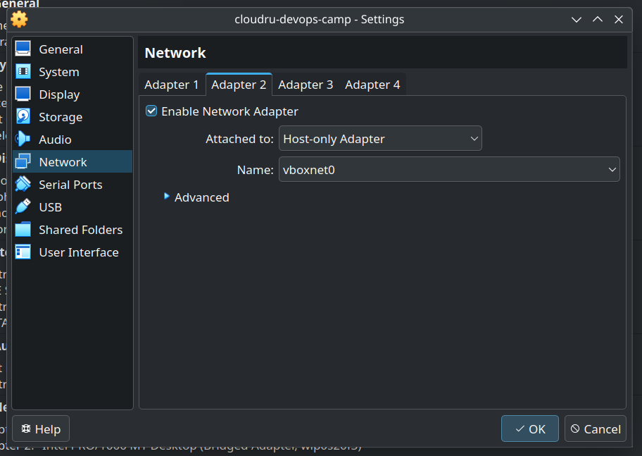

## 02-ansible

Для этого задания я использую Virtual Box.

Выбраный алгоритм балансировки: round_robin (дефолтный алгоритм).
Почему: 

1. ip hash (ip_hash) не не требуется в stateless приложении (используется для поддержания длительных сессий)
2. weighted (server ... weight=3) не подходит, так как инстансы приложения одинаковы (подошел бы для балансировки между несколькими серверами с разными параметрами CPU/RAM)
3. least connection (least_conn) не подходит, так как все запросы к приложению выполняются "быстро" (подошел бы если бы некоторые запросы могли бы выполняться значительно дольше остальных)

Создаю виртуальную машину:


Для доступа к ней с хоста добавляю host-only адаптер (в дополнение к NAT адаптеру по умолчанию; виртуальная машина получает доступ в интернет через NAT и доступ к хосту через host-only адаптеры):


Настраиваю сетевой интерфейс:

```
sudo ip link set enp0s8 up
sudo ip addr add 192.168.56.10/24 dev enp0s8
```


Копирую ssh ключ с хоста и проверяю ssh соединение:


Выполняю сценарии:
1. configure_docker.yml


2. configure_application.yml


3. configure_nginx.yml


Проверяю контейнеры:


Приложение в браузере:


P.S. Мы использовали anible в университете для конфигурации микротиков (виртуалки с ОС микротика объединялись в VPN сеть и конфигурировались плейбуками). При необходимости могу открыть соответствующие репозитории