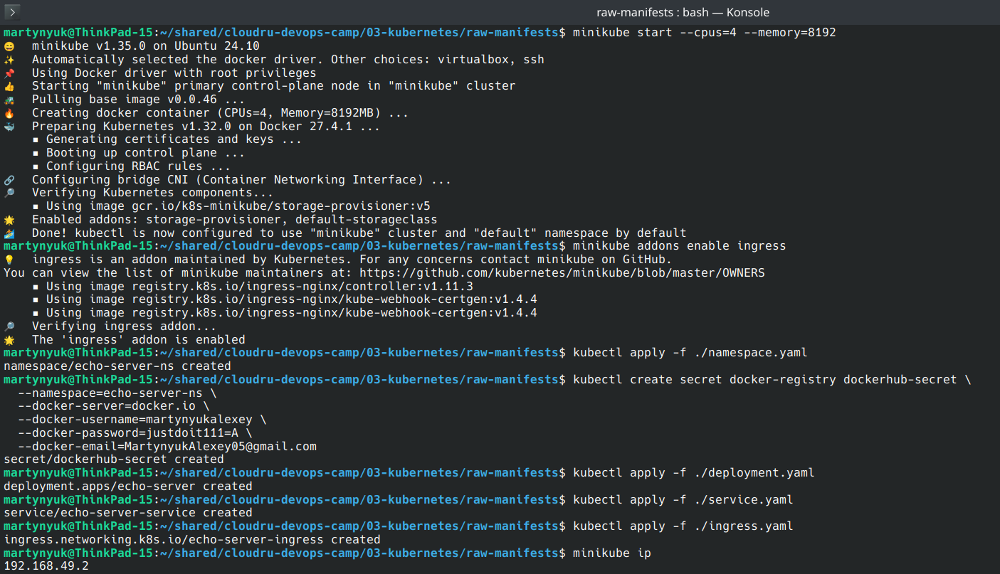
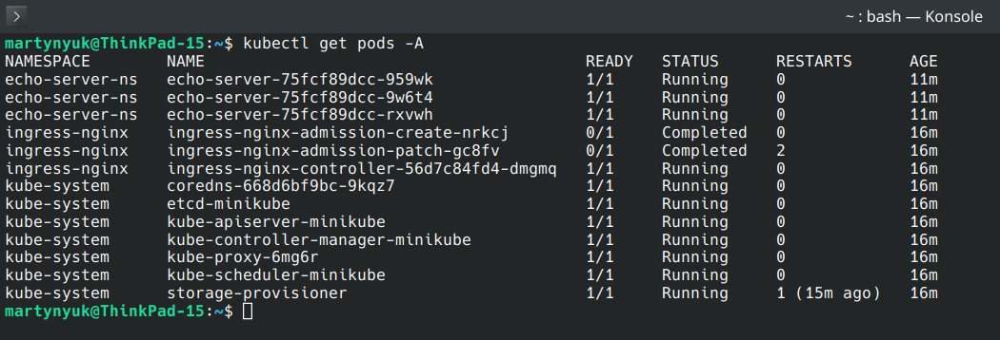
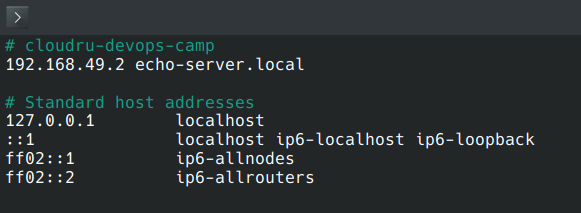
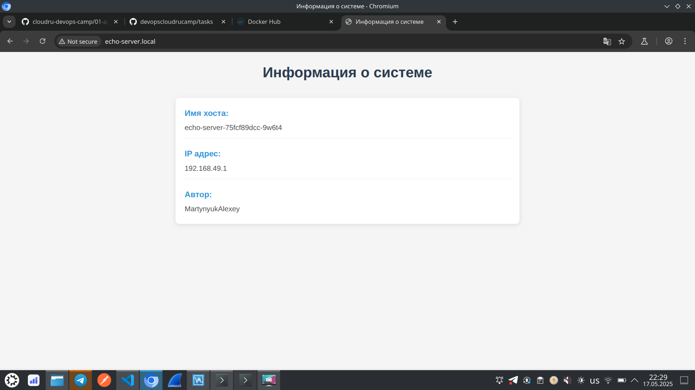
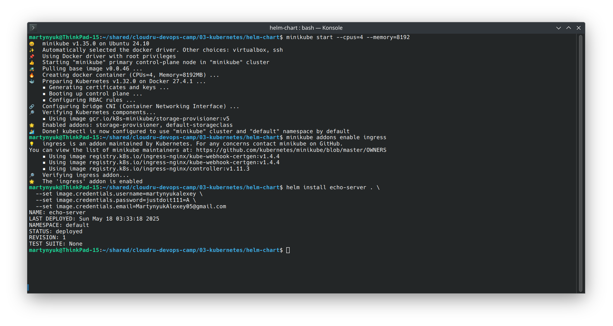
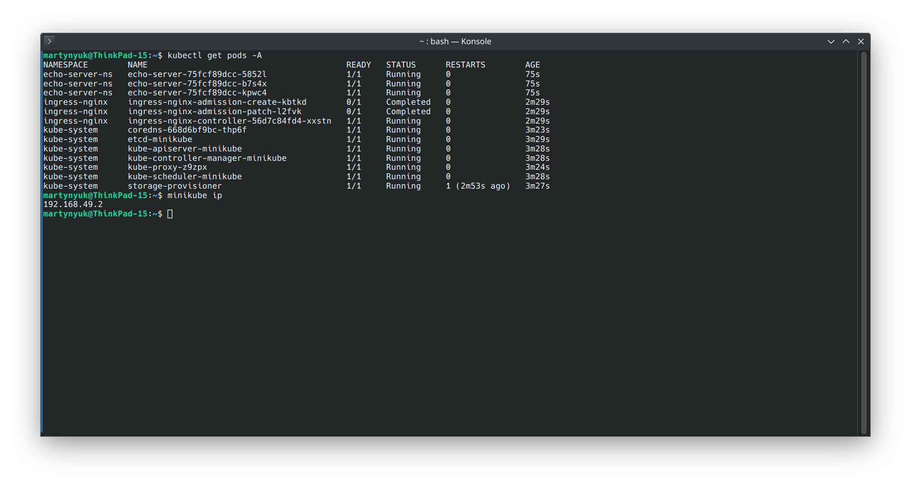
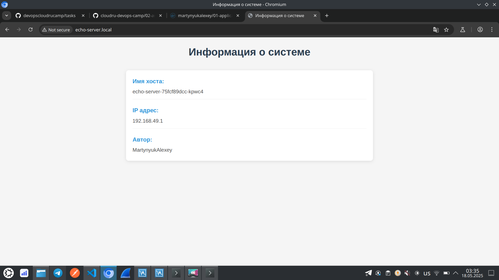

## 03-kubernetes

Для тестирования манифестов я использую minikube.

### Raw manifests

Создаю кластер и разворачиваю приложение:

```
minikube start --cpus=4 --memory=8192

minikube addons enable ingress

kubectl apply -f ./namespace.yaml

kubectl create secret docker-registry dockerhub-secret \
  --namespaces-echo-server-ns \
  --docker-server=docker.io \
  --docker-username=martynyukalexey \
  --docker-password=<password> \
  --docker-email=MartynyukAlexey05@gmail.com

kubectl apply -f ./deployment.yaml
kubectl apply -f ./service.yaml
kubectl apply -f ./ingress.yaml

minikube ip
```



Проверяю, что все работает:



С помощью ```minikube ip``` определяю адрес кластера. 
Добавляю в /etc/hosts соответствующий маппинг:



Открываю приложение в браузере:



### Helm chart

Создаю кластер и разворачиваю приложение:

```
minikube start --cpus=4 --memory=8192

minikube addons enable ingress

helm install echo-server . \
  --set image.credentials.username=martynyukalexey \
  --set image.credentials.password=*password* \
  --set image.credentials.email=MartynyukAlexey05@gmail.com
```



Проверяю, что все работает:



Запись в /etc/hosts осталась после работы с сырыми манифестами (cluster ip не изменился).

Открываю приложение в браузере:


