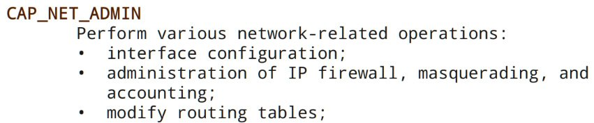

## 04-kubernetes

В норме я бы воспользовался ```iptables``` или сделал бы ```ip route delete```.

Проблема в том, что отсутствует ```cap_net_admin```, без которой ничего из названного (или аналогов) не работает:



Поэтому "красивого" решения я не нашел. 

Есть несколько "некрасивых" вариантов.

Во-первых, чтобы предотвратить возможность сделать apt-get достаточно сломать dns:

```
echo "" > /etc/resolv.conf
```

Во-вторых, можно попробовать подменить соответствующие сисколлы (например, connect() или sendto()) кастомной си-шной библиотекой.